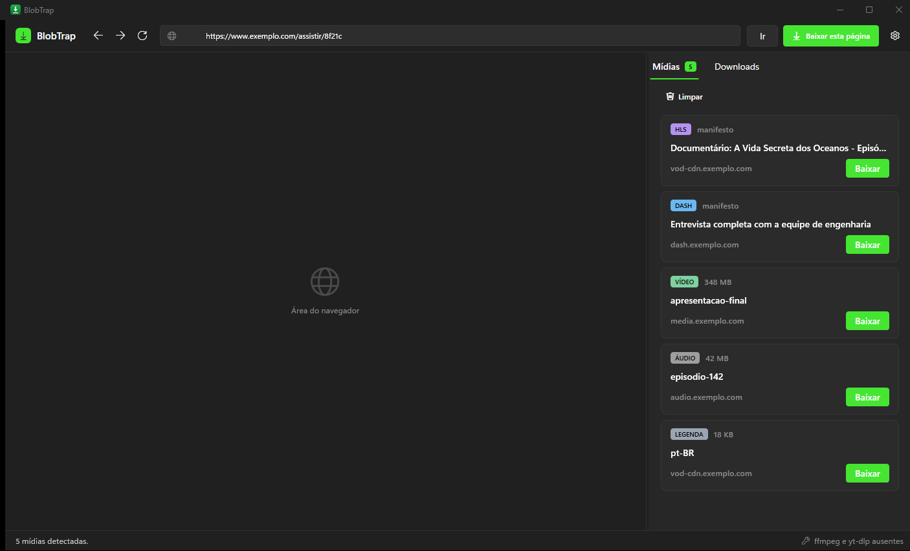
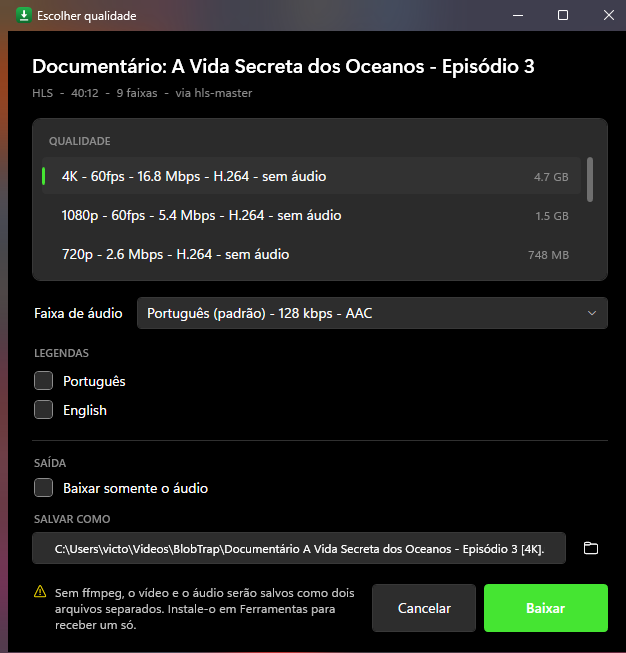
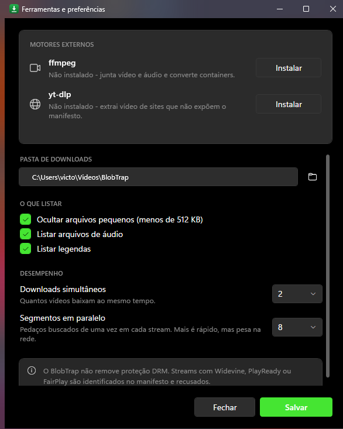

# BlobTrap

Baixador de vídeos para Windows escrito em C#. Você navega dentro do próprio app, o BlobTrap
observa a rede do navegador embutido e lista tudo que for mídia — arquivo direto, HLS, DASH,
legenda — com as qualidades disponíveis para escolher.

O nome vem do problema que ele resolve: players modernos usam `blob:` (MSE), uma URL que não
dá para baixar. O que dá para baixar são os segmentos por trás dela, e é isso que o BlobTrap
captura.

## O que ele faz

- **Navegador embutido (WebView2)** com sniffer via Chrome DevTools Protocol. Vê todas as
  requisições — inclusive as que o pipeline de mídia faz sozinho, que é justamente o caso do
  `blob:`. Sem proxy, sem certificado, sem extensão.
- **Formatos**: HLS (`.m3u8`), DASH (`.mpd`), arquivos progressivos (mp4, webm, mkv, mov, flv…),
  áudio (mp3, m4a, opus…) e legendas (vtt, srt, ttml).
- **Motor próprio em C#** para HLS e DASH: parser de manifesto, download paralelo de segmentos
  com escrita ordenada, decriptação AES-128, e ffmpeg só para remuxar/juntar (`-c copy`, sem
  recodificar).
- **yt-dlp como fallback** para sites cuja mídia nunca aparece como manifesto simples, e para o
  botão "Baixar esta página".
- **Replay de contexto HTTP**: cookies, `Referer`, `Origin`, `User-Agent` e `Authorization`
  capturados do request original são reenviados, senão a CDN devolve 403.
- **Faixas separadas**: quando o vídeo vem sem áudio (o normal em DASH e em HLS com
  `EXT-X-MEDIA`), o BlobTrap baixa as duas e junta com ffmpeg.
- **Retomar de onde parou**: cancelou, caiu a rede ou faltou luz no meio de um filme de 4 GB?
  Os segmentos já baixados ficam no disco e a próxima tentativa continua dali. Vale para
  stream segmentado e para arquivo direto.
- **Tentar de novo**: um 403 tardio não custa renavegar e reescolher qualidade — o botão
  reenfileira com a mesma escolha. Falha por DRM não oferece o botão, porque repetir daria
  exatamente o mesmo erro.

## Interface



| Escolher qualidade | Ferramentas |
| --- | --- |
|  |  |

Segue o Windows 11 em tempo de execução. Lê o tema claro/escuro e a cor de destaque direto do
registro e troca a paleta quando você muda nas Configurações, sem reiniciar o app. Usa a rampa
neutra do WinUI, Segoe UI Variable, Segoe Fluent Icons, cantos arredondados e barra de título
integrada; os diálogos recebem o material acrílico.

A janela principal usa superfície sólida em vez de Mica: ela hospeda o WebView2, que é uma
janela filha opaca cobrindo quase toda a área — o material quase não apareceria, e as regiões
que o DWM não pinta ficam pretas em vez de misturar.

Sobre a cor de destaque: o Windows guarda oito tons em `AccentPalette`, e o tom certo depende do
fundo. Em tema escuro o app usa a variante clara com texto preto, que é o que o WinUI faz.

## O que ele não faz

Não remove DRM. Streams com Widevine, PlayReady, FairPlay ou ClearKey são identificados no
manifesto e recusados com uma mensagem explícita. Isso é uma decisão de projeto, não uma
limitação a contornar.

Você é responsável por ter o direito de baixar o que baixar.

## Instalar

Baixe `BlobTrap-Setup-<versão>.exe` e execute. Instalação por usuário, sem pedir admin, com
atalho no Menu Iniciar e entrada em Adicionar/Remover Programas. O app é publicado
self-contained, então a máquina não precisa ter o .NET instalado.

Requer o **Microsoft Edge WebView2 Runtime**, que já vem no Windows 11. O instalador verifica e
avisa se estiver faltando.

### Gerar o instalador

```powershell
winget install JRSoftware.InnoSetup   # uma vez
pwsh installer\build.ps1
```

Publica, compila o `.iss` e escreve em `dist\`. A versão sai de `<Version>` no
`BlobTrap.App.csproj`; para sobrescrever, use `-Version 1.1.0`.

## Rodar do código

```bash
dotnet build
dotnet run --project src/BlobTrap.App
```

Na primeira execução, abra **Ferramentas** e instale ffmpeg e yt-dlp — o app baixa os dois
para `%LOCALAPPDATA%\BlobTrap\bin`, conferindo o checksum publicado. Sem ffmpeg, streams saem
como `.ts` bruto e faixas separadas não podem ser juntadas.

Para revisar a interface sem navegar nem baixar nada:

```bash
dotnet run --project src/BlobTrap.App -- --design-preview
dotnet run --project src/BlobTrap.App -- --design-preview:downloads
dotnet run --project src/BlobTrap.App -- --design-preview:quality
dotnet run --project src/BlobTrap.App -- --design-preview:tools
```

Abre as janelas reais com conteúdo de amostra. É a mesma tela que o usuário vê, não uma cópia,
justamente para não divergir.

## Como usar

1. Navegue até a página do vídeo na barra de endereço.
2. Dê play. É o play que faz o player buscar o manifesto.
3. As mídias aparecem no painel direito. Clique em **Baixar**.
4. Escolha a qualidade, a faixa de áudio e onde salvar.

Se nada aparecer, use **Baixar esta página** — passa a URL para o yt-dlp, que conhece as regras
de extração de mais de mil sites.

## Estrutura

```
src/BlobTrap.Core/          # tudo que não é UI
  Sniffing/                 # classificação de URL e registro de candidatos
  Hls/                      # parser de playlist M3U8 (RFC 8216)
  Dash/                     # parser de MPD e expansão de templates de segmento
  Resolving/                # manifesto -> lista de qualidades selecionáveis
  Download/                 # download paralelo, AES-128, fila, retomada
  Diagnostics/              # log em arquivo e redaction de segredo
  Tools/                    # ffmpeg, yt-dlp, instalador com checksum
  Net/                      # HttpClient com retry e replay de contexto
src/BlobTrap.App/           # WPF
  Browser/                  # sniffer CDP e sonda de DOM
  Theming/                  # tema do sistema, paleta de acento, efeitos de janela
  ViewModels/  Views/
installer/                  # script Inno Setup e build
tests/BlobTrap.Tests/       # 259 testes
```

## Testes

```bash
dotnet test
```

Cobrem o que quebra silenciosamente:

- **Parsing HLS**: atributos com vírgula dentro de aspas, byte ranges encadeados, IV derivado
  do media sequence, variante só de áudio numa master mista.
- **Parsing DASH**: templates `$Number%05d$`, `SegmentTimeline` com `r=`, herança de `BaseURL`
  e de duração de período.
- **AES-128**: round-trip de decriptação, IV curto, chave inválida.
- **Chaves de recurso XAML**: toda referência `StaticResource`/`DynamicResource` tem que
  existir. O compilador não verifica isso — uma chave errada compila com zero avisos e só
  estoura quando a janela abre.
- **Paleta de acento**: decodificação com cor assimétrica nas duas ordens de bytes possíveis.
  Testar com o verde desta máquina não provaria nada, porque nele o vermelho é igual ao azul.
- **Redaction**: com os formatos que aparecem de verdade — `hdnts` da Akamai,
  `Policy`/`Signature` do CloudFront, `X-Amz-*` do S3, cabeçalho `Cookie`, caminho do perfil.
  O log é o arquivo que a pessoa anexa num relato de bug; ele não pode conter a sessão dela.
- **Retomada de segmentado**: um servidor HTTP local de verdade derruba o download no meio e
  o teste prova duas coisas — que a retomada produz bytes idênticos aos de baixar de uma vez,
  e que os segmentos já gravados não voltam para a rede. Sem essa segunda parte o teste
  passaria com a retomada desligada, porque rebaixar tudo também dá os bytes certos.
- **Fila de download**: limite de concorrência sob carga, e estado final que não regride —
  um download concluído que a interface jura estar baixando não estoura em lugar nenhum.

A suíte roda sem rede, sem ffmpeg e sem yt-dlp, exceto o teste de retomada, que sobe seu
próprio servidor em `127.0.0.1`.

## Diagnóstico

Quando algo falha, o log fica em `%LOCALAPPDATA%\BlobTrap\logs`, um arquivo por dia e sete
dias de retenção. Ele registra o ciclo de vida de cada download, a saída de erro do ffmpeg e
do yt-dlp, e por que o resolvedor caiu para o fallback.

Tudo passa por redaction antes de tocar o disco: token assinado de CDN, cabeçalho `Cookie` e
o nome de usuário no caminho saem redigidos. Host e caminho ficam, porque sem eles o log não
diz qual CDN recusou nem qual segmento quebrou.

A versão instalada de cada peça — BlobTrap, ffmpeg e yt-dlp — aparece em **Ferramentas**.
